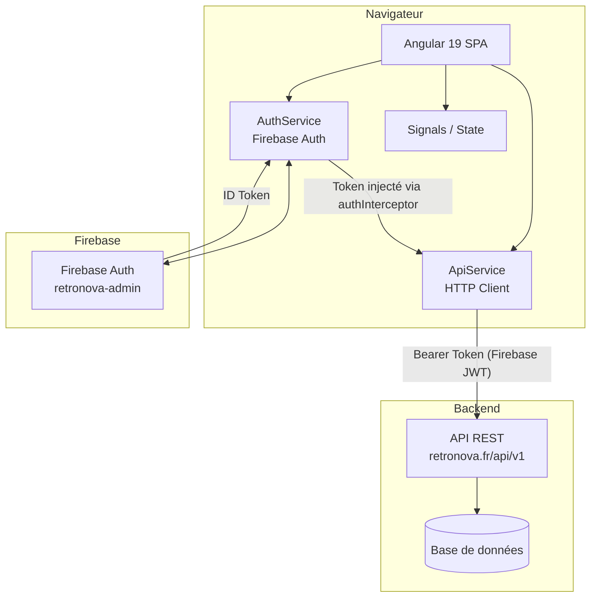
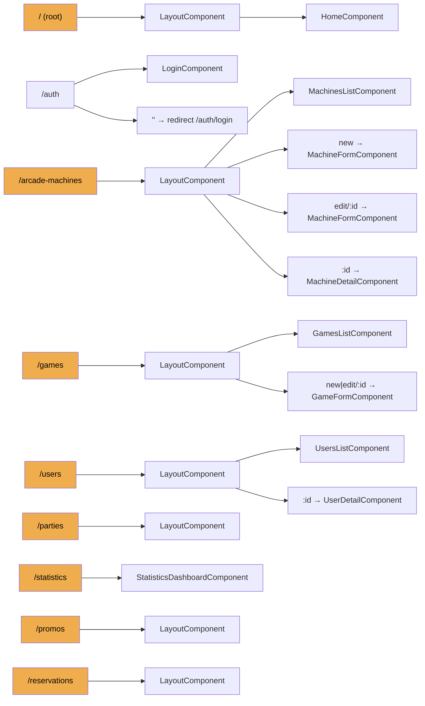
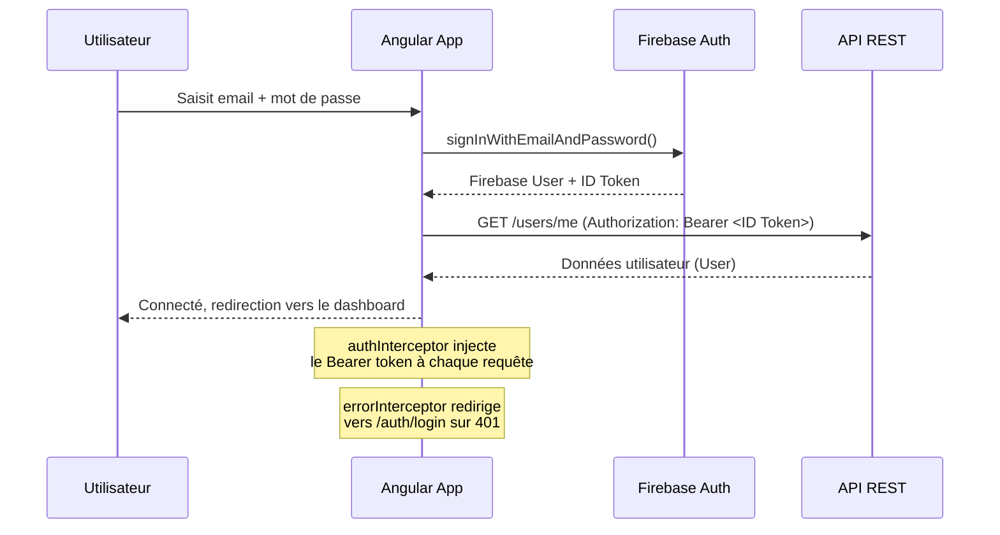

# Documentation Technique — RetroNova Backoffice

> **Dernière mise à jour :** Mai 2026  
> **Version de l'application :** 0.0.0  
> **Framework :** Angular 19  
> **Destinataires :** Nouveaux développeurs rejoignant le projet

---

## Table des matières

1. [Vue d'ensemble du projet](#1-vue-densemble-du-projet)
2. [Architecture générale](#2-architecture-générale)
3. [Installation et démarrage](#3-installation-et-démarrage)
4. [Configuration](#4-configuration)
5. [Routage](#5-routage)
6. [Authentification](#6-authentification)
7. [Modèles de données](#7-modèles-de-données)
8. [Services principaux](#8-services-principaux)
9. [Features (modules fonctionnels)](#9-features-modules-fonctionnels)
10. [Composants partagés (shared/)](#10-composants-partagés-shared)
11. [Déploiement](#11-déploiement)
12. [Conventions et points d'attention](#12-conventions-et-points-dattention)

---

## 1. Vue d'ensemble du projet

### Contexte métier

**RetroNova Backoffice** est l'interface d'administration de la plateforme RetroNova, un réseau de bornes d'arcade connectées. Cette application permet aux administrateurs de :

- Gérer les **bornes d'arcade** (création, configuration, attribution de jeux, suivi des files d'attente)
- Gérer le **catalogue de jeux** (ajout, modification, suppression)
- Superviser les **utilisateurs** (consultation, modification des tickets, suppression/restauration)
- Suivre les **parties** en cours et terminées
- Gérer les **réservations** de bornes
- Créer et administrer les **codes promotionnels**
- Consulter les **statistiques** globales de la plateforme

### Stack technique

| Couche | Technologie | Version |
|--------|-------------|---------|
| Framework frontend | Angular | ^19.2.0 |
| Composants UI | PrimeNG | ^19.1.3 |
| Icônes | PrimeIcons + FontAwesome Free | 7.0.0 / 6.7.2 |
| Authentification | Firebase (AngularFire) | ^11.7.3 / ^19.1.0 |
| Graphiques | Chart.js (via PrimeNG) | ^4.4.9 |
| Styles | SCSS (global) | — |
| Réactivité | Signals Angular 19 | — |
| Tests | Karma + Jasmine | ~6.4.0 / ~5.1.0 |
| Serveur web (prod) | nginx:alpine | — |
| Conteneurisation | Docker | — |
| Langage | TypeScript | ~5.7.2 |

### Prérequis

- **Node.js** ≥ 20.x
- **npm** ≥ 10.x
- **Angular CLI** ^19.x (`npm install -g @angular/cli`)
- Un compte Firebase avec accès au projet `retronova-admin`
- Accès à l'API REST RetroNova (voir section [Configuration](#4-configuration))

---

## 2. Architecture générale

### Schéma d'architecture



### Patron architectural

L'application suit un patron **hybride standalone + NgModule**, caractéristique des migrations Angular 19 :

- **Bootstrap** : Mode standalone via `bootstrapApplication()` dans `main.ts` et `app.config.ts`
- **Feature modules** : Déclarés en NgModule (ex : `DashboardModule`, `GamesModule`) mais leurs **composants de page sont standalone**
- **Réactivité** : Basée sur les **Signals Angular 19** (`signal()`, `computed()`, `effect()`) plutôt que sur les Observables RxJS pour la gestion d'état locale
- **Lazy loading** : Toutes les features sont chargées à la demande via `loadChildren` / `loadComponent`

### Structure des dossiers

```
src/
├── main.ts                     # Point d'entrée de l'application
├── styles.scss                 # Styles globaux (importe src/styles/)
├── index.html                  # Shell HTML
├── environments/               # Variables d'environnement (dev / prod)
│   ├── environment.development.ts
│   └── environment.prod.ts
├── styles/                     # Fichiers SCSS globaux
│   ├── variables.scss          # Variables CSS custom properties
│   ├── tokens.scss             # Design tokens
│   ├── mixins.scss             # Mixins SCSS réutilisables
│   ├── animations.scss         # Animations globales
│   ├── arcade-context.scss     # Styles thème arcade
│   ├── global.scss             # Reset et styles de base
│   ├── utilities.scss          # Classes utilitaires
│   └── primeicons.scss         # Override PrimeIcons
└── app/
    ├── app.config.ts           # Configuration bootstrap (providers, intercepteurs)
    ├── app.routes.ts           # Définition des routes principales (SOURCE DE VÉRITÉ)
    ├── app-routing.module.ts   # ⚠️ Vestigial — ne pas modifier
    ├── app.component.*         # Composant racine
    ├── core/                   # Logique transversale (services, modèles, guards)
    │   ├── auth/               # Authentification (guard, service Firebase)
    │   ├── factories/          # Factory de formulaires (FormFactory)
    │   ├── interceptors/       # Intercepteurs HTTP (auth, errors)
    │   ├── models/             # Interfaces TypeScript des entités métier
    │   ├── providers/          # Providers Angular (notifications)
    │   ├── services/           # Services applicatifs
    │   └── state/              # État global de l'application (AppStateService)
    ├── features/               # Modules fonctionnels (lazy-loaded)
    │   ├── auth/               # Pages de connexion
    │   ├── dashboard/          # Tableau de bord principal
    │   ├── arcade-machines/    # Gestion des bornes d'arcade
    │   ├── games/              # Gestion des jeux
    │   ├── users/              # Gestion des utilisateurs
    │   ├── parties/            # Gestion des parties
    │   ├── reservations/       # Gestion des réservations
    │   ├── promos/             # Gestion des codes promotionnels
    │   └── statistics/         # Statistiques et analytics
    └── shared/                 # Code partagé entre features
        ├── shared.module.ts    # NgModule legacy (imports PrimeNG, CommonModule…)
        ├── components/         # Composants communs (sidebar, header, loader…)
        ├── ui/                 # Composants UI atomiques (button, tag, input, card)
        ├── pipes/              # Pipes personnalisés (format, math, safe)
        ├── directives/         # Directives personnalisées (arcade-glow)
        └── utils/              # Classes utilitaires statiques
```

---

## 3. Installation et démarrage

### Cloner et installer

```bash
git clone https://github.com/retronova-industry/Retronova-backoffice.git
cd Retronova-backoffice
npm install
```

### Démarrer en développement

```bash
npm start
# ou
ng serve
```

L'application est accessible sur `http://localhost:4200`.

Le serveur de développement recharge automatiquement à chaque modification de fichier.

### Build de production

```bash
npm run build
# Sortie dans : dist/retro-nova-backoffice/browser/
```

### Lancer les tests

```bash
npm test
# Lance Karma avec Chrome (headless par défaut)
```

### Mode watch (build incrémental)

```bash
npm run watch
# Build en mode développement avec rechargement automatique
```

---

## 4. Configuration

### Variables d'environnement

Les environnements sont définis dans `src/environments/`. La substitution de fichiers est gérée par Angular CLI dans `angular.json`.

**`src/environments/environment.development.ts`** — Développement local :
```typescript
export const environment = {
  production: false,
  apiUrl: 'http://localhost:8000/api/v1',
  firebase: {
    projectId: 'retronova-admin',
    // ... autres clés Firebase
  }
};
```

**`src/environments/environment.prod.ts`** — Production :
```typescript
export const environment = {
  production: false,   // ⚠️ À corriger : devrait être true
  apiUrl: 'https://apitest.retronova.fr/api/v1',
  firebase: {
    projectId: 'retronova-admin',
    // ... autres clés Firebase
  }
};
```

> **Note :** Les deux environnements utilisent le même projet Firebase (`retronova-admin`). La configuration Firebase complète (apiKey, authDomain, storageBucket, messagingSenderId, appId) est présente dans ces fichiers. **Ne pas committer ces fichiers avec de vraies clés de production dans un repo public.**

### Configuration Angular (`angular.json`)

| Paramètre | Valeur |
|-----------|--------|
| Répertoire source | `src/` |
| Sortie du build | `dist/retro-nova-backoffice/` |
| Styles globaux | `node_modules/@fortawesome/fontawesome-free/css/all.min.css`, `src/styles.scss` |
| Langue des styles inline | SCSS |
| Configuration par défaut (build) | `production` |
| Configuration par défaut (serve) | `development` |

**Budgets de taille (production) :**

| Type | Avertissement | Erreur |
|------|--------------|--------|
| Bundle initial | 1,5 MB | 2 MB |
| Styles par composant | 20 kB | 25 kB |

### Configuration TypeScript (`tsconfig.json`)

| Option | Valeur | Signification |
|--------|--------|---------------|
| `target` | ES2022 | Standard de sortie JavaScript |
| `module` | ES2022 | Format de module |
| `moduleResolution` | `bundler` | Résolution via l'outil de build |
| `strict` | `true` | Toutes les vérifications strictes activées |
| `noImplicitOverride` | `true` | `override` obligatoire en héritage |
| `noImplicitReturns` | `true` | Retour explicite requis |
| `isolatedModules` | `true` | Compatibilité esbuild |
| `strictTemplates` | `true` | Vérification de type dans les templates Angular |

---

## 5. Routage

### Architecture des routes



> Les routes en **orange** sont protégées par `authGuard`.

### Fichier de routes principal

**`src/app/app.routes.ts`** est la source de vérité pour le routage. Toutes les routes sont lazy-loaded :

```typescript
// Exemple de route protégée
{
  path: 'arcade-machines',
  canActivate: [authGuard],
  loadChildren: () => import('./features/arcade-machines/arcade-machines.routes')
    .then(m => m.ARCADE_MACHINES_ROUTES)
}
```

> **⚠️ Important :** Le fichier `app-routing.module.ts` est un vestige de la migration. Il ne contient pas toutes les routes (`promos` et `reservations` sont absentes). **Toute modification de routage doit être faite dans `app.routes.ts` uniquement.**

### `authGuard`

Défini dans `src/app/core/auth/auth.guard.ts`. C'est un **guard fonctionnel** (`CanActivateFn`) qui :
1. Vérifie l'état d'authentification Firebase
2. En cas d'échec, redirige vers `/auth/login?returnUrl=<url-actuelle>`

---

## 6. Authentification

### Flux d'authentification



### `AuthService` (`src/app/core/auth/auth.service.ts`)

Service injecté globalement (`providedIn: 'root'`). Gère l'état d'authentification via les Signals Angular 19.

| Signal / Computed | Type | Description |
|-------------------|------|-------------|
| `currentUser` | `signal<User \| null>` | Utilisateur connecté |
| `isAuthenticatedSignal` | `computed` | `true` si `currentUser !== null` |
| `isLoading` | `signal<boolean>` | Indique un chargement en cours |

| Méthode | Description |
|---------|-------------|
| `login(email, password)` | Authentifie via Firebase, récupère le profil depuis `/users/me` |
| `logout()` | Déconnexion Firebase + réinitialisation du signal |
| `isAuthenticated()` | Observable issu de `firebaseAuth.authState` |
| `getFirebaseToken()` | Observable du token Firebase ID courant |
| `getCurrentUser()` | Snapshot synchrone de l'utilisateur courant |

À l'initialisation, `initializeAuth()` restaure automatiquement la session depuis Firebase si un utilisateur est déjà connecté.

### Intercepteurs HTTP

**`authInterceptor`** (`src/app/core/interceptors/auth.interceptor.ts`) :
- Intercepte toutes les requêtes HTTP sortantes
- Récupère le token Firebase ID courant
- Ajoute le header `Authorization: Bearer <token>`

**`errorInterceptor`** (`src/app/core/interceptors/error.interceptor.ts`) :
- Intercepte les réponses HTTP en erreur
- Sur **HTTP 401** : si aucun utilisateur Firebase, redirige vers `/auth/login?returnUrl=<url-actuelle>` (l'URL de retour est sanitisée pour éviter les open-redirect)
- Toutes les autres erreurs sont re-propagées

### `TokenService` (`src/app/core/services/token.service.ts`)

Gestionnaire de tokens JWT compatible SSR (vérifie l'existence de `localStorage`).

| Méthode | Description |
|---------|-------------|
| `saveToken(token)` | Persiste le token dans `localStorage` |
| `getToken()` | Récupère le token |
| `removeToken()` | Supprime le token |
| `decodeToken(token)` | Décode le payload JWT (Base64, sans vérification de signature) |
| `getTokenData()` | Retourne `{ sub, exp }` |

---

## 7. Modèles de données

Les modèles sont définis dans `src/app/core/models/`. Ils décrivent les structures de données échangées avec l'API.

### Utilisateur (`user.model.ts`)

```typescript
interface User {
  id: number;
  firebase_uid: string;
  email: string;
  nom: string;
  prenom: string;
  pseudo: string;
  date_naissance: string;       // ISO date
  numero_telephone: string;
  tickets_balance: number;
  created_at: string;
  updated_at: string;
  deleted_at?: string | null;
  is_deleted: boolean;
}
```

Interfaces associées : `UserCreate`, `UserUpdate`, `UserSearchResponse`, `LoginCredentials`, `AuthToken`, `TokenData`

### Jeu (`game.model.ts`)

```typescript
interface Game {
  id: number;
  nom: string;
  description: string;
  min_players: number;
  max_players: number;
  ticket_cost: number;
  created_at: string;
  updated_at: string;
  is_deleted: boolean;
  arcade_games?: ArcadeGameRelation[];
  scores?: GameScore[];
}
```

Enums : `GameCategory` (`FIGHTING | ARCADE | PUZZLE | RACING | SHOOTING | PLATFORM | RETRO`), `GameDifficulty` (`EASY | MEDIUM | HARD | EXPERT`)

Interface enrichie : `EnrichedGame` étend `Game` avec `category?`, `difficulty?`, `popularity_score?`, `weekly_plays?`, `arcade_count?`, `status?`

### Borne d'arcade (`arcade.model.ts`)

```typescript
interface Arcade {
  id: number;
  nom: string;
  description?: string;
  api_key: string;
  localisation: string;
  latitude: number;
  longitude: number;
  created_at: string;
  updated_at: string;
  is_deleted: boolean;
  games?: GameOnArcade[];       // Jeux assignés (slot 1 et 2)
}

interface GameOnArcade {
  id: number;
  nom: string;
  min_players: number;
  max_players: number;
  ticket_cost: number;
  slot_number: 1 | 2;           // Chaque borne a 2 emplacements de jeu
}
```

Interfaces associées : `ArcadeCreate`, `ArcadeUpdate`, `ArcadeGameAssignment`, `QueueItem`

### Partie (`party.model.ts`)

```typescript
interface Party {
  id: UUID;
  player1_id: UUID;
  player2_id: UUID;
  game_id: UUID;
  machine_id: UUID;
  total_score: number;
  p1_score: number;
  p2_score: number;
  done: boolean;
  cancel: boolean;
  created_at: string;
}
```

### Réservation (`reservation.model.ts`)

```typescript
enum ReservationStatus {
  WAITING = 'waiting',
  PLAYING = 'playing',
  COMPLETED = 'completed',
  CANCELLED = 'cancelled'
}

interface Reservation {
  id: number;
  player_id: number;
  player2_id?: number;
  arcade_id: number;
  game_id: number;
  unlock_code: string;
  status: ReservationStatus;
  tickets_used: number;
}
```

### Code promotionnel (`promo.model.ts`)

```typescript
interface PromoCode {
  id: number;
  code: string;
  tickets_reward: number;
  is_single_use_global: boolean;
  is_single_use_per_user: boolean;
  usage_limit?: number;
  current_uses: number;
  is_active: boolean;
}
```

### Score (`score.model.ts`)

```typescript
interface Score {
  id: number;
  player1_pseudo: string;
  player2_pseudo: string;
  game_name: string;
  arcade_name: string;
  score_j1: number;
  score_j2: number;
  winner_pseudo: string;
  created_at: string;
}
```

> **⚠️ Doublon :** `score.model.ts` et `scores.model.ts` définissent des interfaces identiques. Utiliser `score.model.ts` (réexporté depuis `index.ts`).

### Ticket (`ticket.model.ts`)

```typescript
interface TicketOffer {
  id: number;
  tickets_amount: number;
  price_euros: number;
  name: string;
}
```

### Amitié (`friend.model.ts`)

```typescript
enum FriendshipStatus { PENDING, ACCEPTED, REJECTED }

interface Friendship {
  id: number;
  status: FriendshipStatus;
  requester: { id: number; pseudo: string; nom: string; prenom: string };
  requested: { id: number; pseudo: string; nom: string; prenom: string };
}
```

---

## 8. Services principaux

### `ApiService` — Service HTTP de base

**Fichier :** `src/app/core/services/api.service.ts`

Tous les services métier délèguent leurs appels HTTP à ce service. Il encapsule `HttpClient` d'Angular.

| Méthode | Description |
|---------|-------------|
| `get<T>(endpoint, params?)` | Requête GET avec paramètres de query optionnels (`HttpParams`) |
| `post<T>(endpoint, data)` | Requête POST |
| `put<T>(endpoint, data)` | Requête PUT |
| `delete<T>(endpoint, params?)` | Requête DELETE |
| `getBlob(endpoint, params?)` | Requête GET retournant un `Blob` (téléchargement) |

L'URL de base est lue depuis `environment.apiUrl`.

### Services métier

Tous les services métier suivent le même **pattern signal-based** :
- Un `signal<T[]>` interne fait office de cache en mémoire
- Les méthodes de récupération (`getAll…`) alimentent ce signal
- La méthode `clearCache()` vide le signal pour forcer un rechargement

#### `ArcadesService`

**Fichier :** `src/app/core/services/arcades.service.ts`

| Méthode | Endpoint | Note |
|---------|----------|------|
| `getAllArcades()` | `GET /arcades` | Met à jour le signal |
| `getArcadeById(id)` | `GET /arcades/:id` | |
| `getArcadeQueue(arcadeId)` | `GET /arcades/:id/queue` | File d'attente en temps réel |
| `getArcadeConfig(arcadeId)` | `GET /arcades/:id/config` | |
| `createArcade(data)` | `POST /admin/arcades` | Admin requis |
| `assignGameToArcade(assignment)` | `PUT /admin/arcades/:id/games` | Admin requis |
| `updateArcade(id, data)` | `PUT /admin/arcades/:id` | Admin requis |
| `deleteArcade(id)` | `DELETE /admin/arcades/:id` | Admin requis |
| `clearCache()` | — | Réinitialise le signal |

#### `GamesService`

**Fichier :** `src/app/core/services/games.service.ts`

| Méthode | Endpoint |
|---------|----------|
| `getAllGames()` | `GET /games` |
| `getGameById(id)` | `GET /games/:id` |
| `createGame(data)` | `POST /admin/games` |
| `updateGame(id, data)` | `PUT /admin/games/:id` |
| `deleteGame(id)` | `DELETE /admin/games/:id` |

#### `UsersService`

**Fichier :** `src/app/core/services/users.service.ts`

| Méthode | Endpoint | Note |
|---------|----------|------|
| `getAllUsers()` | `GET /admin/users/deleted` | ⚠️ Endpoint trompeur : retourne tous les users |
| `getDeletedUsers()` | `GET /admin/users/deleted` | Même endpoint |
| `getUserById(id)` | `GET /users/:id` | |
| `searchUsers(query, limit)` | `GET /users/search?q=&limit=` | |
| `updateMyProfile(data)` | `PUT /users/me` | |
| `updateUserTickets(userId, tickets)` | `PUT /admin/users/tickets` | Admin requis |
| `deleteUser(userId)` | `DELETE /users/:id` | Soft delete |
| `restoreUser(userId)` | `PUT /admin/users/:id/restore` | Admin requis |

#### `ReservationsService`

**Fichier :** `src/app/core/services/reservations.service.ts`

| Méthode | Endpoint |
|---------|----------|
| `getAllReservations()` | `GET /admin/reservations/` |
| `getReservationById(id)` | `GET /reservations/:id` |
| `createReservation(data)` | `POST /reservations` |
| `cancelReservation(id)` | `DELETE /reservations/:id` |

#### `PromosService`

**Fichier :** `src/app/core/services/promos.service.ts`

Utilise un `BehaviorSubject` + un `PromoCacheManager` interne (Map avec TTL de 5 minutes).

| Méthode | Endpoint |
|---------|----------|
| `listPromoCodes()` | `GET /admin/promo-codes` |
| `createPromoCode(data)` | `POST /admin/promo-codes` |
| `usePromoCode(data)` | `POST /promos/use` |
| `getHistory()` | `GET /promos/history` |

#### `PartiesService`

**Fichier :** `src/app/core/services/parties.service.ts`

Mappe les réponses de l'API `/games` vers le modèle `Party` via un adaptateur interne `gameToParty()`.

| Méthode | Description |
|---------|-------------|
| `getAllParties(includeDeleted)` | `GET /games` |
| `getActiveParties()` | `GET /games?done=false&cancel=false` |
| `getCompletedParties()` | `GET /games?done=true` |
| `getPartiesByMachine(machineId)` | Filtre par borne |
| `getPartyById(id, includeDeleted)` | `GET /games/:id` |

#### `AdminService`

**Fichier :** `src/app/core/services/admin.service.ts`

| Méthode | Endpoint | Description |
|---------|----------|-------------|
| `getStats()` | `GET /admin/stats` | Retourne `AdminStats` |
| `getDeletedUsers()` | `GET /admin/users/deleted` | |
| `restoreUser(userId)` | `PUT /admin/users/:id/restore` | |

**Interface `AdminStats` :**
```typescript
interface AdminStats {
  active_users: number;
  total_arcades: number;
  total_games: number;
  active_promo_codes: number;
  total_tickets_in_circulation: number;
  timestamp: string;
}
```

### Services utilitaires

#### `NotificationService`

**Fichier :** `src/app/core/services/notification.service.ts`  
Encapsule `MessageService` de PrimeNG pour afficher des toasts système.

| Méthode | Sévérité |
|---------|---------|
| `showSuccess(message, title?)` | `success` |
| `showError(message, title?)` | `error` |
| `showInfo(message, title?)` | `info` |
| `showWarning(message, title?)` | `warn` |

#### `ToastService`

**Fichier :** `src/app/core/services/toast.service.ts`  
Système de toast indépendant de PrimeNG, basé sur les Signals. File d'attente limitée à 5 toasts simultanés.

| Méthode | Durée par défaut |
|---------|-----------------|
| `success(msg, title?, duration?)` | 5 secondes |
| `error(msg, title?, duration?)` | 8 secondes |
| `warning(msg, title?, duration?)` | — |
| `info(msg, title?, duration?)` | — |

#### `ThemeService`

**Fichier :** `src/app/core/services/theme.service.ts`  
Gestion du thème clair/sombre/système.

| Signal | Type | Description |
|--------|------|-------------|
| `currentTheme` | `signal<'light' \| 'dark' \| 'system'>` | Thème sélectionné |
| `effectiveTheme` | `computed<'light' \| 'dark'>` | Thème appliqué (résout `system`) |

- Persiste la préférence dans `localStorage` (clé : `app-theme`)
- Applique l'attribut `data-theme` sur `document.documentElement`
- Écoute les changements `prefers-color-scheme`

#### `SmartCacheService`

**Fichier :** `src/app/core/services/smart-cache.service.ts`  
Cache en mémoire avancé basé sur les Signals, avec persistance optionnelle `localStorage`.

| Option | Type | Description |
|--------|------|-------------|
| `ttl` | `number` | Durée de vie en ms |
| `maxSize` | `number` | Nombre max d'entrées |
| `strategy` | `'LRU' \| 'LFU' \| 'FIFO'` | Stratégie d'éviction |
| `persist` | `boolean` | Persister dans `localStorage` |

Expose un décorateur `@Cacheable(options?)` pour la mise en cache automatique de méthodes.

#### `AppStateService`

**Fichier :** `src/app/core/state/app-state.service.ts`  
État global de l'application, `providedIn: 'root'`.

```typescript
// Shape de l'état
{
  user: User | null,
  theme: 'light' | 'dark' | 'retro',   // défaut : 'retro'
  sidebarOpen: boolean,                  // défaut : true
  notifications: Notification[],
  isLoading: boolean
}
```

Selectors publics : `user`, `theme`, `isAuthenticated`, `unreadNotifications`  
Actions : `setUser(user)`, `toggleSidebar()`

---

## 9. Features (modules fonctionnels)

### Feature : Auth

**Chemin :** `src/app/features/auth/`  
**Route d'accès :** `/auth`  
**Guard :** aucun (route publique)

| Route | Composant | Description |
|-------|-----------|-------------|
| `login` | `LoginComponent` | Formulaire de connexion |
| `` | — | Redirige vers `login` |

**`LoginComponent`** — Formulaire réactif avec :
- Champs : `email` (required, format email), `password` (required, min. 6 caractères)
- Appelle `AuthService.login()`
- Redirige vers `returnUrl` après succès (sanitisée : doit commencer par `/` et ne pas commencer par `//`)
- Affiche des toasts PrimeNG en cas d'erreur

---

### Feature : Dashboard

**Chemin :** `src/app/features/dashboard/`  
**Route d'accès :** `/` (racine)

| Composant | Description |
|-----------|-------------|
| `LayoutComponent` | Shell avec sidebar + `<router-outlet>` |
| `HomeComponent` | Tableau de bord principal |

**`HomeComponent`** charge en parallèle (`forkJoin`) : utilisateurs, bornes, jeux, parties actives. Affiche 4 cartes de métriques :
- Utilisateurs (total)
- Parties actives
- Jeux (total)
- Bornes actives / bornes totales

---

### Feature : Arcade Machines

**Chemin :** `src/app/features/arcade-machines/`  
**Route d'accès :** `/arcade-machines`

| Route | Composant | Description |
|-------|-----------|-------------|
| `` | `MachinesListComponent` | Liste des bornes avec recherche |
| `new` | `MachineFormComponent` | Formulaire de création |
| `edit/:id` | `MachineFormComponent` | Formulaire d'édition |
| `detail/:id` | `MachineDetailComponent` | Vue détaillée d'une borne |

**`MachinesListComponent`** : Calcule pour chaque borne un objet `EnrichedArcade` (ajoute `status`, `utilization_rate`, `game1_name`, `game2_name`, `has_both_slots`). Recherche textuelle en temps réel.

**`MachineDetailComponent`** : Vue à 3 onglets (aperçu, statistiques, activité). Auto-refresh de la file d'attente via `interval`. Utilise `PrimeNG TimelineModule` et `ChartModule`. Nettoie les subscriptions via `Subject` + `takeUntil` dans `ngOnDestroy`.

---

### Feature : Games

**Chemin :** `src/app/features/games/`  
**Route d'accès :** `/games`

| Route | Composant |
|-------|-----------|
| `` | `GamesListComponent` |
| `new` | `GameFormComponent` |
| `edit/:id` | `GameFormComponent` |

**`GamesListComponent`** : Tableau PrimeNG avec filtres calculés (`totalGames`, `singlePlayerGames`, `multiplayerGames`, `filteredGames`). Recherche sur `nom` et `description`.

---

### Feature : Users

**Chemin :** `src/app/features/users/`  
**Route d'accès :** `/users`

| Route | Composant |
|-------|-----------|
| `` | `UsersListComponent` |
| `:id` | `UserDetailComponent` |

**`UsersListComponent`** : Utilise `effect()` pour mettre à jour `filteredUsers` de façon réactive dès que `searchQuery` change. Filtre sur `nom`, `prenom`, `pseudo`, `email`.

---

### Feature : Parties

**Chemin :** `src/app/features/parties/`  
**Route d'accès :** `/parties`

| Composant | Description |
|-----------|-------------|
| `PartiesListComponent` | Liste de toutes les parties |
| `PartiesDetailsComponent` | Détail d'une partie |

---

### Feature : Reservations

**Chemin :** `src/app/features/reservations/`  
**Route d'accès :** `/reservations`

| Route | Composant |
|-------|-----------|
| `` | `ReservationsListComponent` |
| `:id` | `ReservationsDetailComponent` |

**`ReservationsListComponent`** : Filtre combiné par statut (`ReservationStatus`) et recherche textuelle sur le nom de la borne, le jeu, et les pseudos des joueurs.

---

### Feature : Promos

**Chemin :** `src/app/features/promos/`  
**Route d'accès :** `/promos`

| Route | Composant | Titre de page |
|-------|-----------|---------------|
| `` | `PromosListComponent` | Codes Promotionnels - RetroNova |
| `new` | `PromoFormComponent` | Nouveau Code Promo - RetroNova |
| `edit/:id` | `PromoFormComponent` | Modifier Code Promo - RetroNova |
| `detail/:id` | `PromosDetailsComponent` | Détails Code Promo - RetroNova |

**`PromosListComponent`** : Calcule un `EnrichedPromoCode` par code (ajoute `status`, `usage_percentage`, `remaining_uses`). Le type `PromoStatus` peut valoir : `'active' | 'exhausted' | 'limited' | 'single_use' | 'inactive'`.

---

### Feature : Statistics

**Chemin :** `src/app/features/statistics/`  
**Route d'accès :** `/statistics`

| Composant | Description |
|-----------|-------------|
| `StatisticsDashboardComponent` | Dashboard analytique complet |

Charge toutes les données en parallèle (`forkJoin`). Affiche des graphiques `Chart.js` (barres, lignes), un filtre de plage de dates (`CalendarModule` PrimeNG), et un classement des meilleurs joueurs.

---

## 10. Composants partagés (shared/)

### Composants UI atomiques (`shared/ui/`)

Ces composants sont **standalone** et constituent la base du design system.

#### `ButtonComponent` (`ui-button`)

**Fichier :** `src/app/shared/ui/`

| Input | Type | Description |
|-------|------|-------------|
| `label` | `string` | Texte du bouton |
| `icon` | `string` | Classe d'icône FontAwesome / PrimeIcons |
| `iconPos` | `'left' \| 'right'` | Position de l'icône |
| `variant` | `'primary' \| 'secondary' \| 'danger' \| 'ghost' \| 'ghost-danger'` | Style visuel |
| `size` | `'default' \| 'sm'` | Taille |
| `loading` | `boolean` | État de chargement (spinner) |
| `disabled` | `boolean` | Désactivé |
| `type` | `'button' \| 'submit' \| 'reset'` | Type HTML natif |
| `tooltip` | `string` | Info-bulle |

Output : `clicked` (EventEmitter)

#### `TagComponent` (`ui-tag`)

| Input | Type | Description |
|-------|------|-------------|
| `label` | `string` (required) | Texte de l'étiquette |
| `variant` | `'success' \| 'warning' \| 'danger' \| 'info' \| 'default'` | Couleur |
| `icon` | `string` | Icône optionnelle |

#### `InputComponent` et `CardComponent`

Wrappers de formulaire (`app-input`) et de contenu (`app-card`).

---

### Composants communs (`shared/components/`)

| Composant | Sélecteur | Description |
|-----------|----------|-------------|
| `SidebarComponent` | `app-sidebar` | Barre de navigation latérale principale |
| `HeaderComponent` | `app-header` | En-tête de page |
| `LoaderComponent` | `app-loader` | Spinner de chargement |
| `ConfirmationDialogComponent` | — | Encapsule `ConfirmDialog` PrimeNG |
| `GamingButtonComponent` | — | Bouton au style arcade |
| `GamingDataTableComponent` | — | Tableau au style arcade |
| `GamingNotificationComponent` | — | Notification au style arcade |
| `StatsCardComponent` | — | Carte de statistique |

**`SidebarComponent`** contient la navigation principale :

| Groupe | Entrées |
|--------|---------|
| Gestion | Bornes (`/arcade-machines`), Jeux (`/games`), Utilisateurs (`/users`) |
| Opérations | Parties (`/parties`), Réservations (`/reservations`), Promos (`/promos`), Statistiques (`/statistics`) |

**`LoaderComponent`** — Inputs : `size`, `message()` (signal), `fullScreen()` (signal). Utilise une icône FontAwesome en rotation.

---

### Pipes (`shared/pipes/`)

Tous les pipes sont **standalone**, **purs** (`pure: true`), et utilisent la locale `fr-FR`.

#### `FormatPipe` (nom de template : `format`)

| Opération | Description |
|-----------|-------------|
| `number` | Formatage numérique localisé |
| `currency` | Formatage monétaire (EUR) |
| `percentage` | Formatage en pourcentage |
| `fileSize` | Conversion en B/KB/MB/GB |
| `duration` | Durée humaine (secondes → "2h 30m") |
| `shortNumber` | Abréviation (1500 → "1.5K") |

#### `MathPipe` (nom de template : `math`)

| Opération | Description |
|-----------|-------------|
| `round`, `floor`, `ceil` | Arrondis |
| `abs`, `min`, `max` | Valeurs absolues et comparaisons |
| `pow`, `sqrt` | Puissance et racine |
| `random` | Nombre aléatoire |

#### `SafePipe` (nom de template : `safe`)

Bypass du `DomSanitizer` Angular. Opérations : `html`, `style`, `script`, `url`, `resourceUrl`.

> ⚠️ **À utiliser avec prudence.** Ne bypasser la sanitisation que pour des contenus maîtrisés et de confiance.

---

### Directives (`shared/directives/`)

#### `ArcadeGlowDirective` (`[appArcadeGlow]`)

Applique une lueur néon (`box-shadow`) sur l'élément hôte.

| Input | Type | Description |
|-------|------|-------------|
| `color` | `'blue' \| 'purple' \| 'pink' \| 'green'` | Couleur de la lueur |
| `intensity` | `number` | Multiplicateur d'intensité |
| `animated` | `boolean` | Active une animation de pulsation |

Les couleurs sont mappées sur les custom properties CSS : `--neon-blue`, `--neon-purple`, etc. Utilise `effect()` pour réagir aux changements de signals.

---

### Utilitaires (`shared/utils/`)

#### `GamingUtils` (classe statique)

| Méthode | Description |
|---------|-------------|
| `getSlotStatusClass(slot)` | Classe CSS pour l'état d'un emplacement |
| `getSlotStatusLabel(slot)` | Libellé de l'état d'un emplacement |
| `getMachineStatusClass(machine)` | Classe CSS pour l'état d'une borne |
| `getMachineStatusSeverity(machine)` | `'success' \| 'warning' \| 'danger' \| 'info'` |
| `getCategoryIcon(category)` | Icône FontAwesome pour une catégorie de jeu |
| `getCategoryColor(category)` | Couleur CSS pour une catégorie de jeu |

#### `TemplateUtils` (classe statique)

Utilitaires d'aide aux templates Angular (évite d'appeler `Math.*` directement dans les templates).

| Méthode | Description |
|---------|-------------|
| `round / floor / ceil / abs / min / max` | Opérations mathématiques null-safe |
| `truncate(str, max)` | Troncature de chaîne avec "…" |
| `capitalize(str)` | Première lettre en majuscule |
| `titleCase(str)` | Majuscule à chaque mot |
| `isEmpty(arr)` | Vérifie si un tableau est vide |
| `static readonly Math = Math` | Accès à `Math` depuis les templates |

---

### `SharedModule` (`src/app/shared/shared.module.ts`)

NgModule legacy utilisé par les feature modules qui n'ont pas encore été migrés en standalone. Fournit :

**Angular :** `CommonModule`, `RouterModule`, `ReactiveFormsModule`, `FormsModule`

**PrimeNG :** `ButtonModule`, `CardModule`, `TableModule`, `InputTextModule`, `InputNumberModule`, `DropdownModule`, `InputSwitchModule`, `DialogModule`, `ProgressSpinnerModule`, `ToastModule`, `MenuModule`, `DynamicDialogModule`, `ConfirmDialogModule`, `TooltipModule`, `RippleModule`

**Composants déclarés :** `SidebarComponent`, `HeaderComponent`, `LoaderComponent`, `ConfirmationDialogComponent`

---

### `FormFactory` (`src/app/core/factories/form-factory.service.ts`)

Fabrique de formulaires réactifs réutilisables.

| Méthode | Retourne | Validateurs clés |
|---------|----------|-----------------|
| `createGameForm()` | `FormGroup` | `nom` (required, 2–50 chars), `min_players` ≥ 1, `max_players` ≥ 1 |
| `createArcadeForm()` | `FormGroup` | `nom` (required), `localisation` (required), `latitude`, `longitude` |

---

## 11. Déploiement

### Dockerfile (multi-stage)

```dockerfile
# Étape 1 : Build
FROM node:20-alpine AS builder
WORKDIR /app
COPY package*.json ./
RUN npm ci                              # Installation reproductible
COPY . .
RUN npm run build -- --configuration=production

# Étape 2 : Serveur web
FROM nginx:alpine
COPY --from=builder /dist/retro-nova-backoffice/browser /usr/share/nginx/html
COPY nginx.conf /etc/nginx/nginx.conf
RUN chown -R nginx:nginx /usr/share/nginx/html && chmod -R 755 /usr/share/nginx/html
EXPOSE 80
```

### `docker-compose.yml`

```yaml
# Résumé de la configuration
service: retronova-backoffice
image: retronova-backoffice:latest
port: 80:80
restart: unless-stopped
```

| Paramètre | Valeur |
|-----------|--------|
| Variables d'environnement | `NODE_ENV=production` |
| Limite mémoire | 512 MB (réservation : 256 MB) |
| Limite CPU | 0.5 (réservation : 0.25) |
| Sécurité | `no-new-privileges: true` |
| Health check | `wget http://localhost/health` toutes les 30 s, 3 tentatives |
| Logs | `json-file`, max 10 MB × 3 fichiers |
| Réseau | `retronova-network` |

### Build et démarrage Docker

```bash
# Build de l'image
docker build -t retronova-backoffice:latest .

# Démarrage via Compose
docker-compose up -d

# Vérification de l'état
docker-compose ps
docker-compose logs -f retronova-backoffice
```

### Configuration nginx (`nginx.conf`)

| Paramètre | Valeur |
|-----------|--------|
| Port d'écoute | 80 |
| Racine web | `/usr/share/nginx/html` |
| Connexions worker | 1024 |
| Gzip | Activé (text/css/js/xml/json, min. 1024 bytes) |

**Route SPA :** `try_files $uri $uri/ /index.html` — tous les chemins inconnus renvoient l'`index.html` Angular.

**Cache des assets statiques :** `Cache-Control: public, immutable` avec expiration à 1 an pour `.js`, `.css`, `.png`, `.jpg`, `.svg`, `.woff2`, etc.

**En-têtes de sécurité :**

| En-tête | Valeur |
|---------|--------|
| `X-Frame-Options` | `SAMEORIGIN` |
| `X-XSS-Protection` | `1; mode=block` |
| `X-Content-Type-Options` | `nosniff` |
| `Referrer-Policy` | `no-referrer-when-downgrade` |
| `Content-Security-Policy` | `default-src 'self' http: https: data: blob: 'unsafe-inline'` |

**Endpoint de santé :** `GET /health` retourne `200 "healthy\n"` (utilisé par le health check Docker).

---

## 12. Conventions et points d'attention

### Conventions de développement

#### Signals vs Observables

L'application adopte **les Signals Angular 19** comme système de réactivité principal :

```typescript
// ✅ Préféré — Signal dans un service
private _data = signal<MyModel[]>([]);
readonly data = this._data.asReadonly();

// ✅ Préféré — Computed dans un composant
readonly filteredItems = computed(() =>
  this.items().filter(i => i.name.includes(this.searchQuery()))
);

// ✅ Préféré — Effet réactif
effect(() => {
  console.log('Données mises à jour:', this.data());
});
```

Les Observables RxJS restent utilisés pour :
- Les appels HTTP (`HttpClient` retourne des `Observable`)
- `forkJoin` pour le chargement parallèle
- Firebase Auth (`authState`, `idToken`)

#### Composants standalone

Tous les nouveaux composants doivent être **standalone** :

```typescript
@Component({
  standalone: true,
  selector: 'app-mon-composant',
  imports: [CommonModule, RouterModule, /* ... */],
  templateUrl: './mon-composant.component.html'
})
export class MonComposant {}
```

#### Lazy loading

Toutes les features sont lazy-loaded. Pour ajouter une nouvelle feature :

1. Créer le dossier `src/app/features/ma-feature/`
2. Créer un fichier `ma-feature.routes.ts` exportant `MA_FEATURE_ROUTES`
3. Ajouter la route dans **`src/app/app.routes.ts`** uniquement
4. Protéger avec `authGuard` si nécessaire

#### Nommage

| Type | Convention | Exemple |
|------|-----------|---------|
| Composant | `kebab-case` + `.component.ts` | `machines-list.component.ts` |
| Service | `camelCase` + `.service.ts` | `arcades.service.ts` |
| Modèle | `camelCase` + `.model.ts` | `arcade.model.ts` |
| Guard | `camelCase` + `.guard.ts` | `auth.guard.ts` |
| Pipe | `camelCase` + `.pipe.ts` | `format.pipe.ts` |
| Directive | `camelCase` + `.directive.ts` | `arcade-glow.directive.ts` |
| Sélecteur HTML | `app-` (shared/features) ou `ui-` (shared/ui) | `app-sidebar`, `ui-button` |

#### Gestion de la mémoire

Les composants utilisant des `interval` ou des subscriptions Observables doivent nettoyer leurs abonnements :

```typescript
// Pattern recommandé avec destroy$
private destroy$ = new Subject<void>();

ngOnInit() {
  interval(5000).pipe(takeUntil(this.destroy$)).subscribe(() => this.refresh());
}

ngOnDestroy() {
  this.destroy$.next();
  this.destroy$.complete();
}
```

---

### Points d'attention connus

> Ces points ont été identifiés lors de l'analyse de la codebase. Ils ne bloquent pas le fonctionnement mais doivent être gardés en tête.

#### 1. `app-routing.module.ts` est vestigial

Le fichier `src/app/app-routing.module.ts` est un vestige de la migration vers le mode standalone. Il ne contient **pas** les routes `promos` et `reservations`.

**Action :** N'éditer que `src/app/app.routes.ts` pour toute modification de routage.

#### 2. `environment.prod.ts` a `production: false`

```typescript
// ⚠️ À corriger
export const environment = {
  production: false,  // Devrait être true
  ...
};
```

**Impact :** Certaines optimisations et comportements spécifiques à la production peuvent ne pas être activés.

#### 3. Doublon `score.model.ts` / `scores.model.ts`

Les deux fichiers définissent des interfaces identiques (`Score`, `CreateScoreRequest`, `PlayerStats`). Seul `score.model.ts` est réexporté depuis `core/models/index.ts`.

**Action :** Utiliser uniquement `score.model.ts`. Le fichier `scores.model.ts` peut être supprimé après vérification des imports.

#### 4. `getAllUsers()` utilise l'endpoint `/admin/users/deleted`

```typescript
// ⚠️ Nom trompeur dans UsersService
getAllUsers() {
  return this.api.get('/admin/users/deleted'); // Retourne tous les users, pas seulement les supprimés
}
```

**Action :** Vérifier avec le backend si cet endpoint retourne bien tous les utilisateurs ou seulement les supprimés.

#### 5. `keyboard-shortcuts.service.ts` est entièrement commenté

Le fichier `src/app/core/services/keyboard-shortcuts.service.ts` existe mais est intégralement mis en commentaire. Il n'est pas fonctionnel.

#### 6. `documentation.md` est obsolète

L'ancien fichier `documentation.md` à la racine décrit un projet **React** antérieur à la migration vers Angular. Il ne reflète pas la codebase actuelle. Ce fichier peut être archivé ou supprimé.

---

*Documentation générée pour la codebase RetroNova Backoffice — Angular 19 — Mai 2026*
